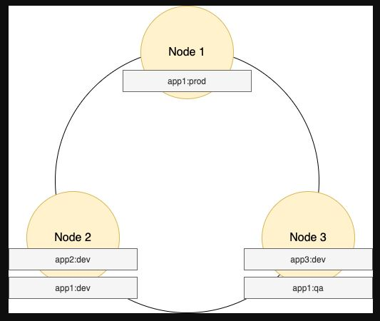

# Project description
This project is about a music store where we get the raw data and make transformations.

# Technologies
We used Cassandra.

## About Cassandra
Cassandra is a NoSQL database that used Nodes. Basically, you create a partition key to create a node in system file. Each node use a hashkey as a index, so when you do a select statement is really fast because the query do a direct access on the data

